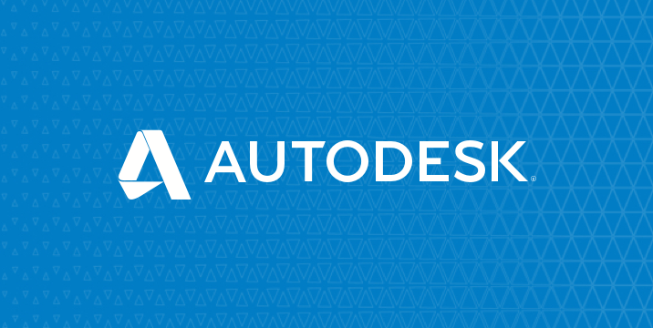

[](https://nodejs.org/)

[](http://opensource.org/licenses/MIT)

[](http://developer-autodesk.github.io/)
[](http://developer-autodesk.github.io/)
[](http://developer-autodesk.github.io/)
[](http://developer-autodesk.github.io/)
[](http://developer-autodesk.github.io/)

# webhooks & properties

**Note:** For using this sample, you need a valid oAuth credential.
Visit this [page](https://forge.autodesk.com) for instructions to get on-board.

## Description

This sample exercises the Node.js engine with typescript to demonstrate the Forge OAuth application authorisation process and most of the Forge Services API such as Model Derivative, with Webhooks, ...

## Prerequisites

1. **Forge Account**: Learn how to create a Forge Account, activate subscription and create an app at [this tutorial](http://learnforge.autodesk.io/#/account/).
2. **Visual Studio Code**: other text editors could be used too, but Visual Studio Code is a widely used editor, see [https://code.visualstudio.com/](https://code.visualstudio.com/).
3. **Node.js**: basic knowledge of Node.js, see [https://nodejs.org/en/](https://nodejs.org/en/).
4. **JavaScript/typescript**: basic knowledge.
5. If you want to use the BIM360 API - **BIM 360 or other Autodesk storage account**: if you want to use it with files from BIM 360 Docs then you must be an Account Admin to add the app integration. [Learn about provisioning](https://forge.autodesk.com/blog/bim-360-docs-provisioning-forge-apps).
6. **ngrok**: If you are running a local webserver

## Setup/Usage Instructions

  1. Install [NodeJS](https://nodejs.org)
  2. Download (fork, or clone) this project
  3. Install Node.js dependency modules:

     ```bash
     npm install
     ```

  4. Request your consumer key/secret key from [https://forge.autodesk.com](https://forge.autodesk.com).
  5. Set 2 environment variables FORGE_CLIENT_ID / FORGE_CLIENT_SECRET  
     Mac OSX/Linux (Terminal)

     ```bash
     export FORGE_CLIENT_ID=_YOUR_FORGE_CLIENT_ID
     export FORGE_CLIENT_SECRET=YOUR_FORGE_CLIENT_SECRET
     ```

     Windows (use **Node.js command line** from Start menu)

     ```batch
     set FORGE_CLIENT_ID=_YOUR_FORGE_CLIENT_ID
     set FORGE_CLIENT_SECRET=YOUR_FORGE_CLIENT_SECRET
     ```

  6. Set an environment variable PORT (This is for running either BIM360 API or the Viewer)  
     Mac OSX/Linux (Terminal)

     ```bash
     export PORT=YOUR_PORT_NUMBER
     ```

     Windows (use **Node.js command line** from Start menu)

     ```batch
     set PORT=YOUR_PORT_NUMBER
     ```

  7. **Note** for the 3 legged commands: while registering your keys, make sure that the callback you define for your
     callback (or redirect_uri) match your localhost and PORT number.  
     Default is: [http://localhost:3001/oauth](http://localhost:3001/oauth)  
     Mac OSX/Linux (Terminal)

     ```bash
     export FORGE_CALLBACK=YOUR_FORGE_CALLBACK_URL
     ```

     Windows (use **Node.js command line** from Start menu)

     ```batch
     set FORGE_CALLBACK=YOUR_FORGE_CALLBACK_URL
     ```

  8. Provision your application key on the BIM360 application integration page. [Learn about provisioning](https://forge.autodesk.com/blog/bim-360-docs-provisioning-forge-apps).
  9. Set an environement variable FORGE_WEBHOOKS  
     Mac OSX/Linux (Terminal)

     ```bash
     export FORGE_WEBHOOKS=YOUR_FORGE_WEBHOOK_URL
     ```

     Windows (use *Node.js command line** from Start menu)

     ```batch
     set FORGE_WEBHOOKS=YOUR_FORGE_WEBHOOK_URL
     ```

  10. Go on the terminal and compile typescript code by running the command **tsc** from both /src/client and /src/server folders.

**Note**: If you do not want to set environment variables, edit the src/server/server/app-settings.ts file and replace the placeholders by the values listed above.

## Usage

TBD

## Personal Notes

```bash
npm install -g typescript
npm install -g tslint
npm init
  src/start.ts
npm install express express-session body-parser compression spdy moment ejs forge-apis --save
npm install "@types/express" "@types/node" "@types/compression" "@types/moment" "@types/ejs" "@types/three" "@types/forge-apis" "@types/forge-viewer" --save-dev
create .jshintignore
create tsconfig.json
  we defined '"watch": true' in tsconfig, go in terminal and type 'tsc'
create tslint.json
create a bin, src, www folders
create a src/start.ts file
```

---

# Further reading

Documentation:

- [BIM 360 API](https://developer.autodesk.com/en/docs/bim360/v1/overview/) and [App Provisioning](https://forge.autodesk.com/blog/bim-360-docs-provisioning-forge-apps)
- [Data Management API](https://developer.autodesk.com/en/docs/data/v2/overview/)
- [Viewer](https://developer.autodesk.com/en/docs/viewer/v6)

Tutorials:

- [View BIM 360 Models](http://learnforge.autodesk.io/#/tutorials/viewhubmodels)
- [Retrieve Issues](https://developer.autodesk.com/en/docs/bim360/v1/tutorials/retrieve-issues)

Blogs:

- [Forge Blog](https://forge.autodesk.com/categories/bim-360-api)
- [Field of View](https://fieldofviewblog.wordpress.com/), a BIM focused blog



## License

This sample is licensed under the terms of the [MIT License](http://opensource.org/licenses/MIT).
Please see the [LICENSE](LICENSE) file for full details.

## Written by

Cyrille Fauvel  
[Forge Partner Development](https://forge.autodesk.com/)  
[Around the Corner blog](https://around-the-corner.typepad.com)  

### Thumbnail


