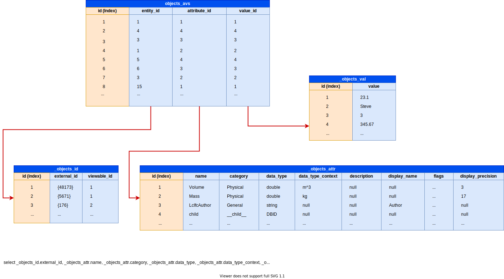

# Property Server

The propertyServer server exercises a workaround to the Forge Model Derivative API limitations of the [request properties](https://developer.autodesk.com/en/docs/model-derivative/v2/reference/http/urn-metadata-guid-properties-GET/) endpoint such as object queries or quota limits. It also demonstrates how to parse the bubble SVF/SVF2 property files.

Support SVF, SQL, and SVF2 formats - SVF (.json.gz Viewer optimized files), SQL (sqllite database), and SVF2 (.idx, .pack, .json optimized files).

## Format and ObjectID

### Formats

#### SVF

* objects_attrs.json.gz {common} - Attribute Definition list (JSON array), you should ignore the first element. Indexed on the AttrID starting with index 1. For Attribute Definition details see below.

* objects_vals.json.gz {common} - Attribute Values list (JSON array), you should ignore the first element. Indexed on the ValID starting with index 1.

* objects_ids.json.gz {common} - Unique ID (aka externalID) list (JSON ARRAY), you should ignore the first element. Indexed on the ObjID starting with index 1.

* objects_avs.json.gz {view dependant} - tbd

* objects_offs.json.gz {view dependant} - tbd


* model.db or model (.sdb) {common} - sqlite database containing all detaisl from .json.gz files. Contains 4 tables only since the OnjID/AttrID/ValID triplets are already built into a table.

  * _objects_attr - Attribute Definition list, you should ignore the first element. Indexed on the AttrID(id) starting with index 1. For Attribute Definition details see below.

  * _objects_val - Attribute Values list, you should ignore the first element. Indexed on the ValID(id) starting with index 1.

  * _objects_id - Unique ID (aka externalID) / ViewableID list, you should ignore the first element. Indexed on the ObjID(id) starting with index 1.

  * _objects_eav - ObjID/AttrID/ValID triplets



#### SVF2

SVF2 is a post process of the SVF format. So under the hood the SVF format still exists, and can be retrieved from the OTG manifest (SVF2 manifest). Remeber SVF is for 3D view only, so SVF2 covers 3D views only as well. The SVF2 Property Database is composed of 3 common files, and 3 view dependant files.

* attrs.json {common} - Attribute Definition list (JSON array), you should ignore the first element. Indexed on the AttrID starting with index 1. For Attribute Definition details see below.

* vals.json {common} - Attribute Values list (JSON array), you should ignore the first element. Indexed on the ValID starting with index 1.

* ids.json {common} - Unique ID (aka externalID) list (JSON ARRAY), you should ignore the first element. Indexed on the ObjID starting with index 1.

* avs.idx {view dependant} - Offset in pack file to retrieve attributes for a given ObjID (Uint32 array), you should ignore the first element. Indexed on the ObjID starting with index 1.

* avs.pack {view dependant} - AttrID / ValID pair list (Uint32 encoded value). AttrID is delta encoded from the previously seen ID. ValID is read directly from the stream. (see _buildEAV()/readUint32() method for details)

* dbid.idx {view dependant} - SVF to SVF2 ID mapping (Uint32 array), you should ignore the first element. Indexed on the SVF ObjID starting with index 1.

#### Attribute Definition

tbd

### ObjectID

tbd

## API definition

(click &#9658; to expand):

<details>
  <summary>GET /:format/:urn/metadata/load</summary>

Loads and returns information about the cached database.

### URI Parameters

* format {string} - Possible values are svf, sql, svf2.

* urn {string} - The Base64 (URL Safe) encoded design URN.

* guid {string, optional} - Unique model view ID. Call [GET :urn/metadata](https://forge.autodesk.com/en/docs/model-derivative/v2/reference/http/urn-metadata-GET) to get the ID. guid can be safely ignored on this endpoint, unless your model does not use a common property DB.

### Query String Parameters

* region {string, optional} - Model Derivative proxy Region. Possible values: US, EMEA. By default, it is set to US, and unless you are using a BIM360 EMEA Hub, it is recommended to leave it to US.

### Example

```bash
curl -X GET http://localhost:3001/svf/dx...Z0/metadata/load
```

Response - 200

```json
{
  "data": {
    "type": "details",
    "maxId": 3277,
    "dbs": {
      "objects_offs": 7672,
      "objects_avs": 33546,
      "objects_vals": 41173,
      "objects_attrs": 5592,
      "objects_ids": 15981
    }
  }
}
```

</details>

<details>
  <summary>GET /:format/:urn/metadata/release</summary>

Releases the cached database from the server memory.

### URI Parameters

* format {string} - Possible values are svf, sql, svf2.

* urn {string} - The Base64 (URL Safe) encoded design URN.

### Example

```bash
curl -X GET http://localhost:3001/svf/dx...Z0/metadata/release
```

Response - 202

```json
{
  "status": "success"
}
```

</details>

<details>
  <summary>GET /:format/:urn/metadata/delete</summary>

Deletes the cached database from the server (memory and storage).

### URI Parameter

* format {string} - Possible values are svf, sql, svf2.

* urn {string} - The Base64 (URL Safe) encoded design URN.

### Example

```bash
curl -X GET http://localhost:3001/svf/dx...Z0/metadata/delete
```

Response - 202

```json
{
  "status": "success"
}
```

</details>

----

<details>
  <summary>GET /:format/:urn/metadata/externalids</summary>

Returns a list of externalID from requested dbID.

### URI Parameters

* format {string} - Possible values are svf, sql, svf2.

* urn {string} - The Base64 (URL Safe) encoded design URN.

### Query String Parameters

* region {string, optional} - Model Derivative proxy Region. Possible values: US, EMEA. By default, it is set to US, and unless you are using a BIM360 EMEA Hub, it is recommended to leave it to US.

* ids {number[], optional} - List of dbID. CSV formatted, using the separator character. Range separator is '-'. If missing returns all.

* sep {string, optional} - Character separator. Default is ','.

### Example

```bash
curl -X GET http://localhost:3001/svf/dx...Z0/metadata/externalids?ids=2824,2830,3270-3277,5
```

Response - 200

```json
{
  "data": {
    "type": "externalIds",
    "collection": {
      "5": "c8923f5e-6a14-4420-9b1d-c31d7ae067d2-00000024",
      "2824": "8c37f8e7-439b-4711-81a8-8b795a6ead1a",
      "2830": "f916c358-f9a7-4a53-8525-49f6ae53aeaa-0004b84b",
      "3270": "425fa4b5-cf64-4260-8581-2345290e5c67-0005832d",
      "3271": "425fa4b5-cf64-4260-8581-2345290e5c67-0005833a",
      "3272": "425fa4b5-cf64-4260-8581-2345290e5c67-0005833c",
      "3273": "425fa4b5-cf64-4260-8581-2345290e5c67-0005833d",
      "3274": "425fa4b5-cf64-4260-8581-2345290e5c67-0005833e",
      "3275": "425fa4b5-cf64-4260-8581-2345290e5c67-00058340",
      "3276": "425fa4b5-cf64-4260-8581-2345290e5c67-00058341",
      "3277": "425fa4b5-cf64-4260-8581-2345290e5c67-00058342"
    }
  }
}
```

</details>

<details>
  <summary>GET /:format/:urn/metadata/ids</summary>

Returns a list of dbId from requested externalID.

### URI Parameters

* format {string} - Possible values are svf, sql, svf2.

* urn {string} - The Base64 (URL Safe) encoded design URN.

### Query String Parameters

* region {string, optional} - Model Derivative proxy Region. Possible values: US, EMEA. By default, it is set to US, and unless you are using a BIM360 EMEA Hub, it is recommended to leave it to US.

* ids {string[], optional} - List of externalID. CSV formatted, using the separator character. If missing returns all.

* sep {string, optional} - Character separator. Default is ','.

### Example

```bash
curl -X GET http://localhost:3001/svf/dx...Z0/metadata/ids?ids=c8923f5e-6a14-4420-9b1d-c31d7ae067d2-00000024,425fa4b5-cf64-4260-8581-2345290e5c67-0005833c
```

Response - 200

```json
{
  "data": {
    "type": "objectids",
    "collection": {
      "c8923f5e-6a14-4420-9b1d-c31d7ae067d2-00000024": 5,
      "425fa4b5-cf64-4260-8581-2345290e5c67-0005833c": 3272
    }
  }
}
```

</details>

<details>
  <summary>GET /svf2/:urn/metadata/svf-svf2</summary>

Returns a list of SVF2 dbId from a lits of SVF dbId .

### URI Parameters

* urn {string} - The Base64 (URL Safe) encoded design URN.

### Query String Parameters

* region {string, optional} - Model Derivative proxy Region. Possible values: US, EMEA. By default, it is set to US, and unless you are using a BIM360 EMEA Hub, it is recommended to leave it to US.

* ids {number[], optional} - List of externalID. CSV formatted, using the separator character. If missing returns all.

* sep {string, optional} - Character separator. Default is ','.

* reverse {boolean, optional} - Invert the mapping - if true would convert SVF2 dbId to SVF dbId. Detault to false.

### Example

```bash
curl -X GET http://localhost:3001/svf2/dx...Z0/metadata/svf-svf2?ids=1,2,2724
curl -X GET http://localhost:3001/svf2/dx...Z0/metadata/svf-svf2?ids=1,2,3177&reverse=true
```

Response - 200

```json
{
  "data": {
    "type": "svf->svf2",
    "mapping": {
      "1": 1,
      "2": 2,
      "2724": 3177,
    }
  }
}
{
  "data": {
    "type": "svf2->svf",
    "mapping": {
      "1": 1,
      "2": 2,
      "3177": 2724,
    }
  }
}
```

</details>

----

<details>
  <summary>GET /:format/:urn/metadata</summary>

Returns an object tree, i.e., a hierarchical list of objects for the model view.

### URI Parameters

* format {string} - Possible values are svf, sql, svf2.

* urn {string} - The Base64 (URL Safe) encoded design URN.

### Query String Parameters

* region {string, optional} - Model Derivative proxy Region. Possible values: US, EMEA. By default, it is set to US, and unless you are using a BIM360 EMEA Hub, it is recommended to leave it to US.

* properties {boolean, optional} - Includes properties in the tree, Default is false.

* keephiddens {boolean, optional} - Keeps hidden properties in the properties node (requires properties=true), Default is false.

* keepinternals {boolean, optional} - Keeps internal properties in the properties node (requires properties=true), Default is false.

### Example

```bash
curl -X GET http://localhost:3001/svf/dx...Z0/metadata
```

Response - 200

```json
{
  "data": {
    "type": "objects",
    "objects": [
      {
        "objectid": 1,
        "name": "Model",
        "objects": [
          {
            "objectid": 2824,
            "name": "Walls",
            "objects": [
              {
                "objectid": 2825,
                "name": "Basic Wall",
                "objects": [
                  {
                    "objectid": 2827,
                    "name": "Generic - 12\" Masonry",
                    "objects": [
                      {
                        "objectid": 2828,
                        "name": "Basic Wall [309068]"
                      },
                      // ...

```

</details>

<details>
  <summary>GET /:format/:urn/metadata/:guid</summary>

Returns an object tree, i.e., a hierarchical list of objects for the model view.

### URI Parameters

* format {string} - Possible values are svf, sql, svf2.

* urn {string} - The Base64 (URL Safe) encoded design URN.

* guid {string} - Unique model view ID. Call [GET :urn/metadata](https://forge.autodesk.com/en/docs/model-derivative/v2/reference/http/urn-metadata-GET) to get the ID.

### Query String Parameters

* region {string, optional} - Model Derivative proxy Region. Possible values: US, EMEA. By default, it is set to US, and unless you are using a BIM360 EMEA Hub, it is recommended to leave it to US.

* properties {boolean, optional} - Includes properties in the tree, Default is false.

* keephiddens {boolean, optional} - Keeps hidden properties in the properties node (requires properties=true), Default is false.

* keepinternals {boolean, optional} - Keeps internal properties in the properties node (requires properties=true), Default is false.

### Example

```bash
curl -X GET http://localhost:3001/svf/dx...Z0/metadata/1234-...-4321
```

Response - 200

```json
{
  "data": {
    "type": "objects",
    "objects": [
      {
        "objectid": 1,
        "name": "Model",
        "objects": [
          {
            "objectid": 2824,
            "name": "Walls",
            "objects": [
              {
                "objectid": 2825,
                "name": "Basic Wall",
                "objects": [
                  {
                    "objectid": 2827,
                    "name": "Generic - 12\" Masonry",
                    "objects": [
                      {
                        "objectid": 2828,
                        "name": "Basic Wall [309068]"
                      },
                      // ...

```

</details>

<details>
  <summary>GET /:format/:urn/metadata/properties</summary>

Returns a list of properties for each object in an object tree for the default viewable node. Properties are returned according to object ID and do not follow a hierarchical structure.

### URI Parameters

* format {string} - Possible values are svf, sql, svf2.

* urn {string} - The Base64 (URL Safe) encoded design URN.

### Query String Parameters

* region {string, optional} - Model Derivative proxy Region. Possible values: US, EMEA. By default, it is set to US, and unless you are using a BIM360 EMEA Hub, it is recommended to leave it to US.

* ids {number[], optional} - List of dbID. CSV formatted, using the separator character. Range separator is '-'.

* sep {string, optional} - Character separator. Default is ','.

* keephiddens {boolean, optional} - Keeps hidden properties in the properties node, Default is false.

* keepinternals {boolean, optional} - Keeps internal properties in the properties node, Default is false.

### Example

```bash
curl -X GET http://localhost:3001/svf/dx...Z0/metadata/properties?ids=2824,2828
```

Response - 200

```json
{
  "data": {
    "type": "properties",
    "collection": [
      {
        "objectid": 2824,
        "name": "Walls",
        "externalId": "8c37f8e7-439b-4711-81a8-8b795a6ead1a",
        "properties": {}
      },
      {
        "objectid": 2828,
        "name": "Basic Wall [309068]",
        "externalId": "f916c358-f9a7-4a53-8525-49f6ae53aeaa-0004b74c",
        "properties": {
          "Analytical Properties": {
            "Absorptance": "0.700 ",
            "Heat Transfer Coefficient (U)": "0.7754 btu / (hour ft^2 degF)",
            "Roughness": "3 ",
            "Thermal Resistance (R)": "1.2897 hour ft^2 degF / (btu)",
            "Thermal mass": "21.8404 btu/degF"
          },
          // ...
        }
      }
    ]
  }
}
```

</details>

<details>
  <summary>GET /:format/:urn/metadata/:guid/properties</summary>

Returns a list of properties for each object in an object tree. Properties are returned according to object ID and do not follow a hierarchical structure.

### URI Parameters

* format {string} - Possible values are svf, sql, svf2.

* urn {string} - The Base64 (URL Safe) encoded design URN.

* guid {string} - Unique model view ID. Call [GET :urn/metadata](https://forge.autodesk.com/en/docs/model-derivative/v2/reference/http/urn-metadata-GET) to get the ID.

### Query String Parameters

* region {string, optional} - Model Derivative proxy Region. Possible values: US, EMEA. By default, it is set to US, and unless you are using a BIM360 EMEA Hub, it is recommended to leave it to US.

* ids {string, optional} - List of dbID. CSV formatted, using ',' separator. Range separator is '-'.

* keephiddens {boolean, optional} - Keeps hidden properties in the properties node, Default is false.

* keepinternals {boolean, optional} - Keeps internal properties in the properties node, Default is false.

### Example

```bash
curl -X GET http://localhost:3001/svf/dx...Z0/metadata/1234-...-4321/properties?ids=2824,2828
```

Response - 200

```json
{
  "data": {
    "type": "properties",
    "collection": [
      {
        "objectid": 2824,
        "name": "Walls",
        "externalId": "8c37f8e7-439b-4711-81a8-8b795a6ead1a",
        "properties": {}
      },
      {
        "objectid": 2828,
        "name": "Basic Wall [309068]",
        "externalId": "f916c358-f9a7-4a53-8525-49f6ae53aeaa-0004b74c",
        "properties": {
          "Analytical Properties": {
            "Absorptance": "0.700 ",
            "Heat Transfer Coefficient (U)": "0.7754 btu / (hour ft^2 degF)",
            "Roughness": "3 ",
            "Thermal Resistance (R)": "1.2897 hour ft^2 degF / (btu)",
            "Thermal mass": "21.8404 btu/degF"
          },
          // ...
        }
      }
    ]
  }
}
```

</details>

----

<details>
  <summary>GET /:format/:urn/metadata/search</summary>

Returns a list of properties for each object in a model. Properties are returned according to the query.

### URI Parameters

* format {string} - Possible values are svf, sql, svf2.

* urn {string} - The Base64 (URL Safe) encoded design URN.

### Query String Parameters

* q {string} - URL encoded query string. Supports Regular Expression.

* region {string, optional} - Model Derivative proxy Region. Possible values: US, EMEA. By default, it is set to US, and unless you are using a BIM360 EMEA Hub, it is recommended to leave it to US.

* bruteforce {boolean, optional} - Method to run teh query, Default is true.

* keephiddens {boolean, optional} - Keeps hidden properties in the properties node (requires properties=true), Default is false.

* keepinternals {boolean, optional} - Keeps internal properties in the properties node (requires properties=true), Default is false.

#### Operators

* not / ! / and / & / or / |

* == / != / ~= / > / >= / < / <=

### Example

```bash
# q = !(Dimensions.Length == 7.292) & (Identity Data.GLOBALID ~= "3K.*")
curl -X GET "http://localhost:3001/svf/dx...Z0/metadata/search?q=%21%28Dimensions.Length%20%3D%3D%207.292%29%20%26%20%28Identity%20Data.GLOBALID%20~%3D%20%223K.%2A%22%29"
```

Response - 200

```json
{
  "data": {
    "type": "properties",
    "collection": [
      ...
    ]
  }
}
```

</details>

----

<details>
  <summary>GET /forge/:urn/metadata</summary>

Returns an object tree, i.e., a hierarchical list of objects for the default model view.

This endpoint forwards the call to the Forge endpoint, and managed the 202 / 429 conditions. Since no GUID is requested on this endpoint, it uses the first (main) GUID from the manifest. Use the next method if you want to provide the GUID.

See [the documentation](https://forge.autodesk.com/en/docs/model-derivative/v2/reference/http/urn-metadata-guid-GET/) for more details.

### URI Parameters

* urn {string} - The Base64 (URL Safe) encoded design URN.

### Query String Parameters

* region {string, optional} - Model Derivative proxy Region. Possible values: US, EMEA. By default, it is set to US, and unless you are using a BIM360 EMEA Hub, it is recommended to leave it to US.

</details>

<details>
  <summary>GET /forge/:urn/metadata/:guid</summary>

Returns an object tree, i.e., a hierarchical list of objects for the model view.

This endpoint forwards the call to the Forge endpoint, and managed the 202 / 429 conditions.

See [the documentation](https://forge.autodesk.com/en/docs/model-derivative/v2/reference/http/urn-metadata-guid-GET/) for more details.

### URI Parameters

* urn {string} - The Base64 (URL Safe) encoded design URN.

* guid {string} - Unique model view ID. Call [GET :urn/metadata](https://forge.autodesk.com/en/docs/model-derivative/v2/reference/http/urn-metadata-GET) to get the ID.

### Query String Parameters

* region {string, optional} - Model Derivative proxy Region. Possible values: US, EMEA. By default, it is set to US, and unless you are using a BIM360 EMEA Hub, it is recommended to leave it to US.

</details>

<details>
  <summary>GET /forge/:urn/metadata/properties</summary>

Returns a list of properties for each object in an object tree for the default viewable node. Properties are returned according to object ID and do not follow a hierarchical structure.

This endpoint forwards the call to the Forge endpoint, and managed the 202 / 429 conditions. Since no GUID is requested on this endpoint, it uses the first (main) GUID from the manifest. Use the next method if you want to provide the GUID.

See [the documentation](https://forge.autodesk.com/en/docs/model-derivative/v2/reference/http/urn-metadata-guid-properties-GET/) for more details.

### URI Parameters

* urn {string} - The Base64 (URL Safe) encoded design URN.

### Query String Parameters

* region {string, optional} - Model Derivative proxy Region. Possible values: US, EMEA. By default, it is set to US, and unless you are using a BIM360 EMEA Hub, it is recommended to leave it to US.

* objectid {long, optional} - Object id which you want to query properties for. If objectid is omitted, the server will return properties for all objects.

</details>

<details>
  <summary>GET /forge/:urn/metadata/:guid/properties</summary>

Returns a list of properties for each object in an object tree. Properties are returned according to object ID and do not follow a hierarchical structure.

This endpoint forwards the call to the Forge endpoint, and managed the 202 / 429 conditions.

See [the documentation](https://forge.autodesk.com/en/docs/model-derivative/v2/reference/http/urn-metadata-guid-properties-GET/) for more details.

### URI Parameters

* urn {string} - The Base64 (URL Safe) encoded design URN.

* guid {string} - Unique model view ID. Call [GET :urn/metadata](https://forge.autodesk.com/en/docs/model-derivative/v2/reference/http/urn-metadata-GET) to get the ID.

### Query String Parameters

* region {string, optional} - Model Derivative proxy Region. Possible values: US, EMEA. By default, it is set to US, and unless you are using a BIM360 EMEA Hub, it is recommended to leave it to US.

* objectid {long, optional} - Object id which you want to query properties for. If objectid is omitted, the server will return properties for all objects.

</details>
